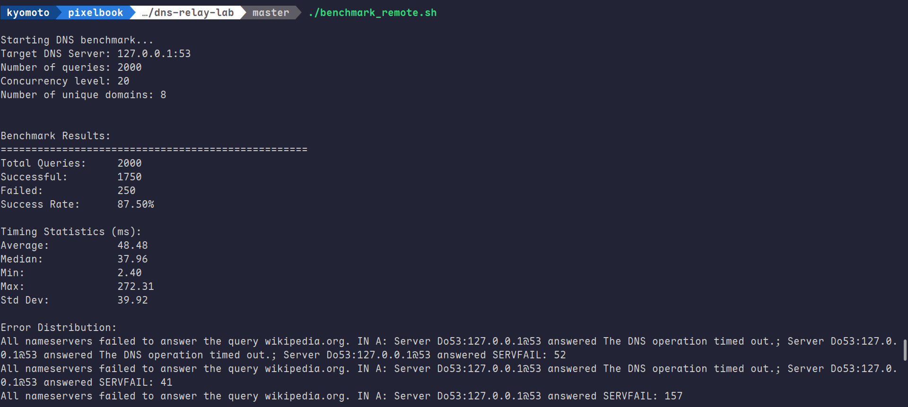
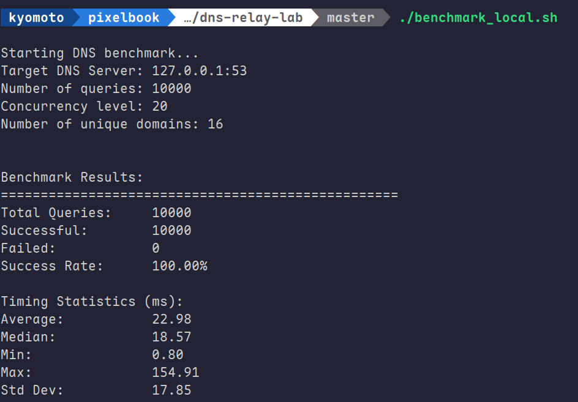
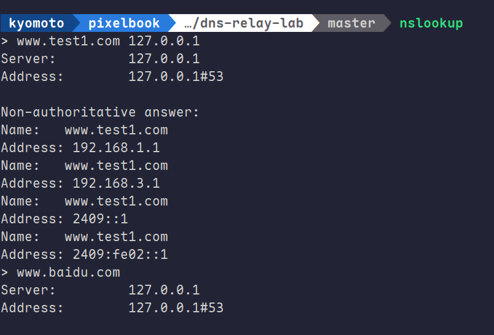

# 1. 代码结构
## 1.1 整体结构
- `dns_relay` - 主程序入口
- `dns_dgram_utils` - 解析与构造DNS报文
- `dns_relay_utils` - 网络事件与数据发送工具

## 1.2 各模块的作用
### 1.2.1 `dns_relay`
- `dns_relay.h`
定义基础配置常量,包括:
1. 监听地址, 上游DNS服务器地址
2. 缓冲区大小
3. 最大并发事件数
4. mappings 文件

- `dns_relay.c`
1. 初始化`initialize()`
  - 创建UDP监听套接字(`listen_fd`)和上游通信套接字(`upstream_fd`)
  - 绑定本地地址
  - 初始化epoll实例,监听两个套接字的读事件

2. 事件循环
  - 通过`epoll_wait()`等待事件(客户端请求 or 上游响应)
  - if event comes from listen_fd -> 1. 解析dns header 2. check if it is in mappings 3. yes then `transform_to_response()` to client 4. no then pass it to upstream dns
    - 本地解析流程: 1. `try_answer_local()`读取mapping文件, 内容为`IP name1 name2 ... name8` 2. `transform_to_response()`将请求报文转换为response, 设置头部`qr = 1, ra = 1`, 根据查询类型构造对应类型的应答段, 用指针压缩重复域名
  - if event comes from upstream_fd -> 根据报文ID查找对应的客户端,转发响应
    - 上游转发流程: 用pending_client暂存客户端信息(以DNS报文ID为索引),受到上游响应后通过报文ID查询原客户端并转发响应

### 1.2.2 `dns_dgram_util`
- `dns_dgram_util.h`
定义了dns相关的核心数据结构,并且利用c语言的特性将位运算巧妙的化为普通的结构体运算

- `dns_dgram_util.c`
1. `parse_question_name`
  - 解析DNS中的域名(支持**指针压缩**), 具体来说, 遇到指针时, 就跳转到指针指向的地址继续将字符拼接到name尾部, 整个过程是递归式的, 即可出现嵌套指针
2. `parse_question_section`
  - 从DNS中提取完整的查询信息(域名,类型,类别)
3. `try_answer_local`
  - 从本地mapping文件中查找域名对应的IP, 具体来说, 先trim掉空白符,然后提取IP, 然后继续trim空白符, 然后提取name
4. `transform_to_response`
  - 将DNS请求报文转换为应答报文(复用原报文缓冲区,添加本地解析结果)

# 2. 运行结果

